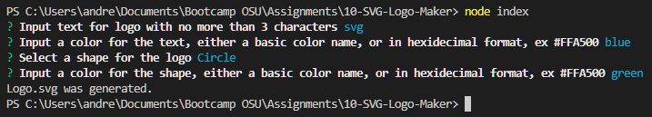
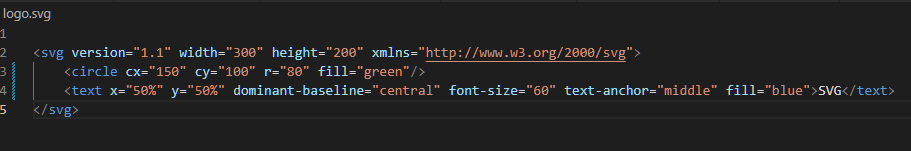

# SVG Logo Maker

## Description
This SVG Logo Maker dynamically generates an svg file based off of user input in the console. The user is able to add text up to 3 characters, choose color for the text, choose one of three shapes (Circle, Square, Triangle), and choose the color of the shape.

## Table of Contents
- [Technologies Used](#technologies-used)
- [Installation](#installation)
- [Usage](#usage)
- [Credits](#credits)
- [License](#license)
- [Project Links](#project-links)
- [Contact Info](#contact-info)

## Technologies Used
JavaScript, Node.js, Inquirer, Jest

## Installation
1. Install Node.js 
2. Clone this repository from Github
3. Open the console and run `npm install` to install the required dependencies for this program
4. Run `node index` inside the console to run the program

## Usage
1. Follow the installation instructions above 
2. After running `npm install` and `node index` in the console, answer all the question prompts in the console
3. Copy the `logo.svg` file that will be generated

Example Screenshots are below

> **Note**: Shows the terminal input for creating the logo

> **Note**: Shows the logo.svg file that the program generates

> **Note**: This is an example logo

## Credits
https://github.com/Destroer47

## License
This project is licensed under the MIT License. To learn more info about the MIT License, click here, https://opensource.org/license/mit/

## Project Links
Github Repository: https://github.com/Destroer47/10-SVG-Logo-Maker
Video Walkthrough: https://drive.google.com/file/d/1vC2Vv1dWweaEFEUKh_qmwtXd-HOw55FH/view?usp=sharing

## Contact Info
My Github Profile: [Destroer47](https://github.com/Destroer47)  
My email: andrewj5787@jesterz.net
